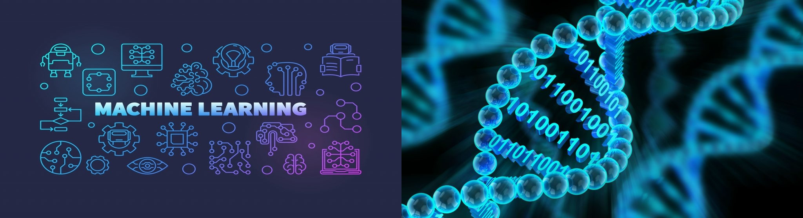

Updated: Sept. 20th 2019.

I'm a MS student in computer science at University of Virginia, advised by [Prof. Madhur Behl](http://www.madhurbehl.com/). My research revolves around interpretable AI. In particular, I study how to accurately evaluate the safety of autonomous vehicles and explain their behaviors by using natural language processing and computer vision. Prior to joining UVa, I received my Bachelor's degree in computer science at UC Berkeley.

Interests: Machine Learning, Bioinformatics

	
<!-- 	

	Hyun Jae Cho 
	Master's student, Computer Science -->
	

Research
======
The main metric of safety evaluation of autonomous vehicles has been “miles per intervention” — the number of miles a car can drive autonomously before a safety driver has to take over the car. However, this metric is not ideal because companies test/drive their autonomous vehicles in different environments. Therefore, I study a way to more accurately compare safety of autonomous cars. Using a simulator, it becomes possible to compare autonomous vehicles in a given setting. Using reinforcement learning, I evaluate how different factors, such as the behavior of non-autonomous vehicles, the weather, and time of day, can affect the behavior of self-driving vehicles, namely Apollo by Baidu.

In Fall 2019, I began my bioinformatics research at [DataBio](http://databio.org/). At DataBio, I am trying to accurately transform transcription factor binding sites (tfbs) from biological experiments into a vector embedding space, which is widely used in the field of natural langauge processing. In addition, our team is trying to develop innovative algorithms to be able to determine the relationship between pairs of tfbs. The applications of this research is significant, including the comparison of bedfiles (bedfiles contain tfbs information) between two biological experiements as well as a new perspective of understanding the interconnections of tfbs.  

Education
======
* M.S. in Computer Science, University of Virginia, (expected Dec. 2019).
  * GPA: 3.96
* B.S. in Computer Science, UC Berkeley University, 2018.

Research & Work Experience
======

* Fall 2018 - current: Graduate Student Researcher
  * University of Virginia
  * Explainable AI - Understanding behaviors of autonomous vehicles and extracting explainability for users.
  * Advisor: [Prof. Madhur Behl](http://www.madhurbehl.com/).
  
* Fall 2019 - current: Graduate Student Researcher
  * University of Virginia
  * Bioinformatics - Transforming transcription factor binding sites into a vector embedding space.
  * Supervisor: [Professor Nathan Sheffield](https://engineering.virginia.edu/faculty/nathan-sheffield).

* Spring 2018: Software Engineer Intern
  * [Phantom AI](https://phantom.ai/)
  * HD Map development plugin - Improved its plugin for building HD (hign Definition) map for autonomous driving.

* Fall 2017: Research Assistant
  * UC Berkeley
  * Computer Vision - Fast Radio Burst localization.
  * Advisor: [Gerry Zhang](https://astro.berkeley.edu/student-profile/2375732-yunfan-gerry-zhang).

* Summer 2017: Research Assistant
  * Emory University
  * Natural Language Processing - Generating tweets of Donald Trump.
  * Advisor: [Prof. Joyce Ho](https://joyceho.github.io/).

Project Reports
======
* Image Classification using Bayesian Neural Networks ([report](https://github.com/hyunjaecho94/Bayesian-neural-network/blob/master/Bayesian_Approach_to_Giving_Neural_Networks_the_Power_to_Reject_to_Classify.pdf)).
* Image Captioning using Conditional Variational AutoEncoders ([report](https://github.com/hyunjaecho94/VAE-ImgCaptioning/blob/master/image_captioning_using_CVAE.pdf)).
  
Teaching
======
* Lab Assistant for CS61A-Structure and Interpretation of Computer Programs at UC Berkeley, 2014.
* Teaching Assistant for CS5010-Programming and Systems for Data Science at University of Virginia, 2019.
